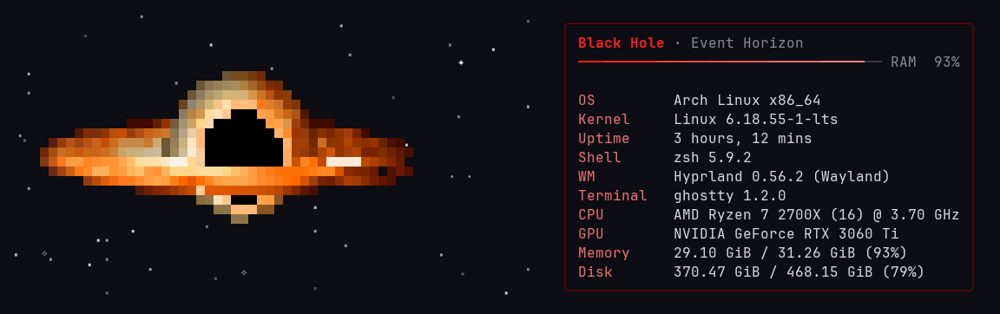

# spacefetch

  

An animated truecolor celestial body beside your system info. There are six bodies, one per
memory usage band: `sun`, `rocky`, `gas`, `ice`, `comet` and `hole`.

## Requirements

- [Bun](https://bun.sh)
- [fastfetch](https://github.com/fastfetch-cli/fastfetch)
- Linux (reads `/proc/meminfo`) and a truecolor terminal

## Usage

    bun src/main.ts                  # 3 s of animation with a random body
    bun src/main.ts --zone hole      # pick the body
    bun src/main.ts --percent 95     # pick the body by a given memory usage
    bun src/main.ts --static         # a single frame, no animation

## In zsh

    source /path/to/spacefetch/spacefetch.zsh
    spacefetch_start

Draws the block at the top of the screen and keeps it animated while you type at the first
prompt. The animation stops at the first command, on Ctrl+L, or after 10 minutes.

## License

[GPL-3.0-or-later](LICENSE). Forks and modified versions you distribute must stay open under the same license.
